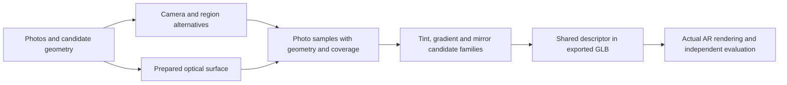

# Product-photo optical candidates

The current implementation produces conditional optical-material candidates and diagnostic GLBs. It does **not** establish an accurate material for every product, select an accepted material, or complete the full reconstruction goal. In particular, generated part labels, camera fits and region masks remain hypotheses.

## Why this is a separate reconstruction stage

A photographed lens pixel contains transmitted background or rear-frame content, reflected illumination, and the camera's response. A darker upper region is not necessarily a tint gradient. A colored mirror can change hue with angle; assigning the photographed RGB to a flat base color loses that behavior. A nearly total mirror can conceal its absorption completely.

The pipeline separates those explanations and tests their consequences in AR:



The saved development products are useful for finding systematic problems. Their old generated models and photographs are not independent evidence that a fresh photo-only reconstruction works.

## Surface preparation and transport

**Current measured limit:** the frozen maximum-Z implementation prepares no complete model in the fixed five-design corpus. Its earlier Victoria Beckham success belongs to a retained implementation snapshot, not the current source. A [separate source-preserving group experiment](OPTICAL_GROUPS.md) is evaluating an alternative; it is not yet connected to this job stage.

`reconstruction/optical_surface.py` constructs a bounded maximum-Z envelope from candidate optical triangles. The candidate's declared roles, transmission properties or names propose optical parts; they do not prove photographic identity. Surface preparation must preserve projected contours, holes and separate components while expressing an effective front surface compatible with `front_sheet_v1`. Back coatings, closed lens volumes and refraction are outside that profile.

`prepare_optics.py` saves surface arrays and geometric diagnostics. A complete preparation exports `prepared-neutral.glb`; its clear diagnostic material is deliberately unrelated to photo inference. Unsupported parts prevent a complete prepared candidate. The algorithm's report retains the numerical precision policy, approximation measurements and unsupported reasons. Actual renderer topology checks remain required.

`optical_asset.py` clones the selected scene's node instances, replaces only the requested primitives and adds baked optical roots. Original binary data, frame geometry, textures and other scenes are preserved. External image URIs are refused because relocating a GLB cannot preserve their relative resources without additional packaging. Every new surface records exact float32 position/normal/UV and integer-index hashes, source-part identity and its full canonical descriptor. The ordinary glTF material is an approximate fallback.

## Photo observations

`photo_lens_observations.py` reads the actual exported attributes and checks their hashes. It uses the original camera normalization for both retained and refined geometry. It never substitutes screen height for optical UV. Normal interpolation follows the production renderer's per-vertex normalization, interpolation and final normalization.

The geometry raster uses linear view depth for both orthographic and perspective projections. A second optical hit before the opaque stop excludes that ray from the single-interface material fitter. Opaque content in front is excluded; opaque content behind is recorded with unknown color. This avoids inventing a black or white temple arm. Exactly coincident surfaces still require the independent topology validator.

All retained mask alternatives survive. A fixed 5 × 5 erosion defines interiors. Deterministic two-dimensional strata choose native photo pixels before excluding unknown coordinates, preserving coverage counts, sample populations and unused capacity. Native centers map to the nearest working-camera pixel; the resulting geometry quantization remains explicit. Raw RGB codes, alpha, endpoints, prepared UV, incidence and camera-relative reflection directions are retained.

The opaque image-border median, decoded with inverse sRGB, is an **uncalibrated effective backdrop hypothesis**. It is not a calibrated background measurement. Rear-frame color remains unknown; more complex rear patterns and translucent frame materials can invalidate the local fit.

## Candidate fitting

`photo_lens_fit.py` is separate from the calibrated inverse instrument in `lens_fit.py`. Its five families are uniform tint, vertical tint gradient, colored Schlick mirror, angular-color mirror, and combined gradient/angular mirror. Their common forward response is the existing canonical `LensAppearance` equation. Angular reflectance uses knots at 0°, 45°, 75° and 90°; the grazing white endpoint, index 1.5 and roughness choices are declared priors. The gradient families place `gradient_density_keyframes` evenly spaced density knots along lens-local v (five by default, smoothstep between neighbours, one curvature penalty per interior knot); fits saved before that field replay with three. Three knots could not bend to the Victoria Beckham gradient, which reaches full darkness well below the top: the shipped fit predicted 5 to 8 codes too bright in a band at v 0.5 to 0.75 on both lenses in both photographs, with the neighbouring bands slightly too dark, and the direction-dependent lighting family did not help (16 codes against 7), which is why the profile and not the illumination got the extra freedom.

The independent baseline shares one lighting hypothesis per photo within each material group. Constant and bounded smooth directional lighting are explored, along with bounded relative exposure/white balance and unknown rear color where needed. The first photo fixes the exposure/white-balance gauge. This baseline does not constrain separate source-part groups with one global lighting solution.

`joint_photo_lens_fit.py` adds a joint alternative: all groups visible in a photograph share its environment field, exposure and white balance while retaining independent material parameters. One exposure/white-balance gauge is fixed per connected photo/group component. Rear colors remain separate unless explicitly bound to the same source object. The default explores five same-family assignments; callers can supply complete mixed-family maps. This is a family prior, not an equality constraint on the materials or an exhaustive mixed-family search.

The joint objective counts each unique training pixel once, weights photos equally and regularizes shared photographic parameters once. Its objective values cannot be compared directly with the independent baseline's differently normalized costs. Roughness choices are factorized because the photo objective does not measure roughness. Completed starts can resume from checksummed checkpoints bound to exact inputs, implementation and numerical versions. The [controlled comparison protocol](JOINT_PHOTO_EVALUATION.md) fixes the development experiment and its interpretation before inspecting results.

Rear content is handled by policy, not by a richer rear model. A sample whose ray meets opaque or undeclared geometry behind the lens is a rear-content sample: its rear radiance is unknown and spatially structured (a folded temple has highlights and edges), and one unknown colour per photo cannot explain it. Under the default `rear_content: excluded`, those samples are ineligible for the residual and for the policy fraction, and are only counted; under `explained`, the earlier unknown-rear-colour and geometry-conditioned modes are explored. The excluded samples are exactly the ray-composition classes `lens_over_opaque` and `lens_over_unresolved` of the physical-group stage; only `lens_over_background` rays are clean transmission samples.

The objective uses one-sided intervals for code 0/255 and quantization intervals for other codes. It retains clipped pixels. Three deterministic starts explore each supported mask/lighting/material configuration. Fixed roughness priors reuse the fit; the local photo model does not identify reflection blur.

Spatial validation tiles are fixed before optimization, with material and nuisance values frozen during validation. The tiling is adaptive (`adaptive_spatial_tiles_share_v2`): the first grid of 4, 8 or 16 at which every eligible observation row keeps the minimum training and validation points and holds at most `maximum_validation_share` (default one half) of its samples in validation is used. The share bound exists because a small far lens can sit almost entirely inside one coarse validation tile (Victoria Beckham's far lens in the angled photograph: 23 training against 81 validation samples at the 4x4 grid), which starves the fit and makes the held-out error a statement about extrapolation rather than about the material. Saved fits from before the bound replay with a share of one. A row decides the policy only on at least `minimum_validation_points_per_photo` held-out samples (24 by default; earlier fits carried 1 and replay with it): on fifteen samples the required 90% of channels was two channels wide, which is how the Victoria Beckham far lens missed the gate at 3.30 codes. The split tries finer grids to reach the minimum, and a row that cannot is reported as `validation_unmeasured` on its candidates and as the selection's `policy_verdict`. Repeated photo pixels do not gain extra training weight through overlapping regions. Duplicate source photos under different IDs are refused. This is a conditional generalization check within the supplied photos, not independent product validation.

All mask combinations survive within the declared work budget. Exceeding capacity reports an unsupported fit rather than selecting a convenient mask. The ordinary two-region, three-alternative case can require 270 starts. The saved Miu model assigns five proposed optical regions to one source part: preserving all combinations can require 7,290 starts. Large runs need an explicit budget; the default is 540.

The output includes every numerical candidate, convergence status, train/validation measurements, nuisance parameters and coverage. Fixed AR response probes expose disagreement between candidate explanations. Their min/max envelope describes the explored candidates only; it is not a certified uncertainty bound. Agreement in these local probes does not test roughness blur, the face or the complete AR renderer.

## Commands and diagnostic previews

These commands require an empty output directory. All inputs and implementation versions are pinned.

```powershell
python -m reconstruction.prepare_optics --model C:/path/candidate.glb --output data/optics/preparation
python -m reconstruction.photo_lens_stage --preparation data/optics/preparation/report.json --regions C:/path/regions/report.json --output data/optics/materials
```

The joint alternative has its own recoverable output directory:

```powershell
python -m reconstruction.joint_photo_lens_stage --preparation data/optics/preparation/report.json --regions C:/path/regions/report.json --output data/optics/joint-materials --maximum-optimization-runs 2430
```

Repeat with `--resume` to verify and reuse completed optimizer starts from the unchanged request. Each preview uses one complete joint candidate. It cannot mix independently ranked lenses from different lighting solutions. Completed outputs are verified before reuse; interrupted export attempts remain on disk.

The standalone joint command also accepts `--jacobian-mode analytic`. Finite differences remain the default. The analytic mode differentiates the same forward model, censored/quantized robust residual and priors; it changes neither observations nor weighting. It is pinned in the policy, optimizer metadata and checkpoint request together with the derivative module's source. Switching mode requires a new output directory.

Thirty paired starts on the first fixed VB mask branch took 38.09 seconds with finite differences versus 7.83 seconds with analytic derivatives during concurrent local work. Residual evaluations decreased from 80,021 to 1,623. Convergence counts were 21 versus 19; the largest objective change was +0.00624 for analytic mode. Faster evaluation does not guarantee the same local trajectory or convergence. This bounded performance instrument is not a replacement for the complete mask ensemble. Six derivative tests and an independent numerical review cover all families, lighting/rear modes, shared aliases, interval endpoints, the sRGB branch boundary and total mirrors. Benchmark evidence is `data/vb-jacobian-benchmark-v1/report.json`.

The region report must belong to the exact source candidate used for preparation. Prepared NPZ surface IDs, groups and quantized attributes must match the exported GLB used for fitting. A consistent-looking report from a different source cannot transfer that fit to another mesh.

The material stage preserves the full ensemble and exports at most one diagnostic representative per family. Its fixed ranking prefers photo-policy matches, convergence, lower worst-region validation error, lower objective, lower roughness prior, then stable candidate ID. These are display choices. Reusing validation to rank them means those ranked previews cannot claim an independent validation score. Missing groups prevent a complete preview; no clear material is silently supplied.

The resumable job exposes the same stages through an opt-in flag:

```powershell
python -m reconstruction.job --request C:/path/request.json --output data/jobs/optical-candidates --region-weights C:/path/sam2.1_hiera_base_plus.pt --lens-candidates
```

Add `--lens-fit-mode joint` for shared photographic lighting; independent fitting remains the default. Mode, `--lens-maximum-optimization-runs` and `--lens-maximum-samples` are immutable job settings. Omitted run budgets are 540 and 2430 respectively. Optical preparation and fitting use the same attempt preservation and hash-checked recovery as other stages. An interrupted job fit starts a new stage attempt; checkpoint reuse within a joint stage is currently available through the standalone command. `candidate.glb` remains the selected geometry proposal. The report links separate optical preview GLBs and their export receipts, with `selected_material: null` and `accepted: false`.

`ar/qa/prepared-optics.mjs` loads pinned generated GLBs in the actual `TryOnRenderer`, checks canonical descriptors and geometry hashes, fits synthetic poses, then renders front, yaw and roll views. Its manifest entries contain `id`, `path`, `model_sha256` and `surfaces` from each export receipt. This tests runtime compatibility, not whether a preview matches a product.

## Evidence required for automatic acceptance

Before selecting a final material automatically, the pipeline needs verified component support, meaningful camera/lighting uncertainty, actual exported-candidate comparisons, and independent products/views. Clear lenses on white backgrounds and strong mirrors can admit different materials that fit the same photos. When those explanations disagree visibly on a face, the result must retain uncertainty or request a more informative input rather than invent confidence.

The next evaluation must include fresh provider outputs, thin metal and rimless constructions, disconnected/closed/curved lenses, asymmetric glasses, gradients, colored and strong mirrors, retouched backgrounds, missing views, duplicate inputs and unrelated objects. Existing-model refinement and controlled renderer fixtures do not cover those requirements. [Current measured evidence](PROGRESS.md) records completed checks separately from this implementation contract.
