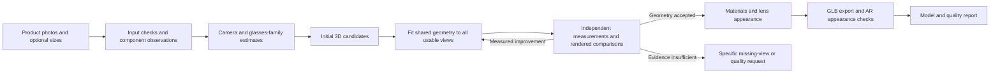

# Photo-to-glasses automation: evidence and development plan

Date: 2026-09-21. Status: original audit and implementation sequence; several stages are now implemented, but the full reconstruction system is not validated. See current evidence for completed work.

For current commands and interfaces, use [the segmented job contract](SEGMENTED_AR_JOB.md) and its optional [canonical Astra editor runbook](SEGMENTED_ASTRA.md). The dated audit and proposed sequence below are retained as historical context.

Follow-up: [architecture review](ARCHITECTURE.md) incorporates the owner's requirements for broader coverage and accurate gradients/high-mirror lenses. [Current evidence](PROGRESS.md) distinguishes experimental building blocks from remaining production work.

## Target agreed with the owner

Input: existing product photos from different angles, with optional dimensions. Output: an accurate-looking, efficient 3D asset for AR try-on. Success belongs to the automation across new products, not to one manually repaired model. Product-specific mesh editing, scripts, or corrective notes count as intervention.

Preserve `ar_v4/modeling_auto` as the comparison baseline. Use its best results as visual references, with the original acceptance history intact. Reuse useful components from the later `ar/modeling` implementation after verifying them. Do not begin by rebuilding the UI, replacing the live AR application, or committing private assets. Current unrelated AR changes remain untouched.

## What the audit established

Source paths beginning with `ar/` or `ar_v4/` are relative to the Lenses repository root. Short paths such as `app/controller.py` and `blender/worker.py` are relative to `ar_v4/modeling_auto/`.

| Finding | Evidence | Implication |
| --- | --- | --- |
| The original app has durable orchestration, saved revisions, provider receipts, recovery, native Blender checks and AR export. | `ar_v4/modeling_auto/app/controller.py`, `app/storage.py`, `blender/worker.py` | Keep this infrastructure and the baseline. |
| Reconstruction accuracy does not govern adoption. | `app/controller.py:1069` adopts revisions; `:1097` validates artifacts and hashes. | A valid file can be a worse reconstruction. |
| The first generated frame is almost immutable. | `app/prompts.py:110`, `blender/worker.py:646` | Later lens/material edits cannot correct incorrect bridge, temple or rim proportions. |
| Rendering assumes canonical orthographic cameras. | `blender/worker.py:949` | Camera mismatch must be resolved before photo residuals can judge geometry. |
| Dimensions are instructions, not fitted geometric constraints. | `app/prompts.py:118`, `blender/worker.py:2095` | Scaling the export to frame width does not establish the other dimensions. |
| A missing seam measurement can look successful. | `blender/worker.py:251` initializes zero values; `:428` checks them without coverage. | Invu job `f8934f43`, r005, reports all checks true with zero loops and zero outline vertices. Treat this seam as unmeasured. |
| Existing seam metrics also disagree with a favorable owner judgment. | Radar job `15d95bd5`, r004: reported tooth 0.527 mm, gap 3.872 mm and 12,540 frame-through faces. | Do not simply promote today's advisory numbers to acceptance gates. Validate the instruments first. |
| Saved runs provide little product diversity. | 14 direct saved jobs: 13 photo-based runs use four distinct five-photo sets, plus one custom derivative without photos. | Seven Oakley runs and four Invu runs measure variability, not eleven different products. |
| The later implementation already has tested operations and a feedback loop. | `ar/modeling/docs/AGENT.md`, `modeling/agent/observe.py` | “Give the agent tools” alone repeats work already done. |
| Its image comparison remains limited. | `ar/modeling/modeling/agent/photo.py:147`, `:272` | Front-view comparison aligns width and centre; it does not fit all reference cameras. Its own caveats describe unreliable dark-lens segmentation and unmatched lighting. |

Historical saved states: three complete/accepted, four waiting for review, six failed, one cancelled. Excluding the custom imported-model derivative leaves three accepted, three waiting for review, six failed and one cancelled photo-based run. These span different runtimes and interventions, so they are **not a controlled success rate**. Existing tests primarily prove software behavior, not fidelity on unseen products. Some older summaries are stale; saved job records take precedence.

Visual inspection of the accepted Oakley and latest Invu confirms recognizable reconstruction, but different lighting and camera framing prevent numerical appearance conclusions from those proof images alone. The latest Invu front reference is only 194 by 259 pixels. Input adequacy must be part of the system.

`baseline-inventory.json` is generated by `../audit_saved_runs.py`. It records hashes, reference-set grouping, states and seam-measurement coverage without copying private photos or provider responses. Its coverage assessment is deliberately not a visual-quality verdict.

## Proposed approach

Build **photo-constrained reconstruction around an editable glasses model**. Meshy can provide an initial candidate; the photos remain the evidence used to fit and judge it. Compare this with incremental improvements to the old pipeline before committing to a broader rewrite.

### 1. Extract evidence before building geometry

Accept a variable number of photos with optional angle labels. Check duplicates, resolution at the actual glasses, cropping, consistent product/colorway, and whether the temples are open differently between photos. Preserve originals and normalization transforms.

Extract frame, lens/opening and temple masks; visible rim contours; bridge, hinge and temple landmarks; and confidence/visibility. Clear, rimless, reflective and dark-on-dark cases need explicit uncertainty. Background showing through a lens is not frame geometry. Upscaling an image must not increase its claimed measurement precision.

Start with reviewed annotations on the small development corpus to validate the geometry fitter independently of segmentation. These annotations are evaluation/development scaffolding: the final end-to-end trial must use automatic extraction, and human annotations must not leak into inference.

### 2. Fit the actual cameras and articulation

Estimate crop, translation, orientation, scale and camera projection for each photo, sharing one 3D glasses shape. Use bounded camera models and independent landmarks; unrestricted camera changes could conceal shape errors. Handle per-photo temple hinge angles separately from permanent temple geometry. A front label does not guarantee a straight-on orthographic image.

Use reliable dimensions as constraints. Check their definitions: temple centreline length is not a bounding-box extent; shield width is not a per-eye lens width. Historical Oakley records contain conflicting layouts and lens widths, so input consistency needs attention. Without a reliable size anchor, output a clearly estimated scale suitable for AR fitting; do not claim measured dimensions.

### 3. Make the geometry editable at the right level

Represent rims and lens boundaries with curves; frame sections, bridges and temples with constrained surfaces/sweeps; hinges, pads and tips as separate components; lenses as smooth independent optical surfaces. Support topology families explicitly: full rim, semi-rimless, rimless and shield. Preserve unusual details through local mesh regions where simple parameters are inadequate.

Do not force every frame into one universal fixed template. Evaluate a Meshy initializer against a structured initializer on the same inputs. Keep Meshy detail where it agrees with the photos; allow bounded geometry corrections when it does not.

Fit geometry using all reliable views: component masks, symmetric contour distances, landmark reprojection, optional dimensions, and sensible regularity constraints. Use soft symmetry only when supported. Score thin frames separately from large lens regions, so a filled lens cannot hide a missing rim.

AI may interpret components, propose operations and diagnose residuals. Tested geometry code executes the changes. Preserve the best candidate; adopt a correction only when valid and measurably better without unacceptable regressions in other views. Bound attempts, detect stagnation, and report unresolved defects.

### 4. Separate geometry, appearance and export judgments

Judge shape with neutral material and component renders. Fit frame colors and textures after the shape is stable. Keep optical lenses separate from texture-generation inputs and preserve component identities through any provider transformation. Compare correspondence in both directions so a missing returned component cannot pass a one-sided distance test.

Treat tint, transparency, gradient, roughness and mirrored coating separately. A product photo mixes material with studio lighting; a cyan reflection is not necessarily a cyan base color. Evaluate under several fixed lighting setups, then in the actual AR renderer. If the renderer cannot express an angle-dependent coating, track that as a rendering limitation rather than deforming geometry or repeatedly recoloring the lens.

Export a packed master and GLB using the current AR handover contract: axes, units, origin, identifiable lenses and temples, material support, triangle/texture budget and hashes. Test the exported, simplified model too: a clean Blender master does not guarantee a clean AR asset. Live AR deployment is a separate release step.

## Implementation milestones and decision gates

1. **Freeze and audit the baseline.** Inventory saved inputs/revisions and deduplicate by product and photo hashes. Separate owner acceptance, assisted recovery and software completion. The read-only collector is the first deliverable; it does not regenerate models.
2. **Prove the evaluator.** Establish reviewed masks/landmarks for the development cases; fit cameras; render matched views; measure per-component residuals and coverage. Create deliberately damaged model variants: missing temple, filled lens opening, bridge offset, floating lens, torn rim, incorrect thickness and wrong tint. The evaluator must detect the intended defect and not pass missing observations. Compare good/bad rankings against blinded visual review. Do not optimize against it until this works.
3. **Run one controlled geometry experiment.** Use identical saved initial meshes and photos for the old result and one new bounded fitting operation. Test whether it improves multiple products and views, including one withheld view where available. Record regressions. Expand only after the experiment supports the approach.
4. **Automate observation and refinement.** Replace reviewed inference inputs with automatic masks/keypoints and uncertainty handling. Integrate the selected fitting approach and verified existing Blender operations. Add best-candidate retention, bounded attempts and a clear `needs_input` result.
5. **Add appearance and AR verification.** Validate lenses, frame texture and export under agreed viewing conditions. Test front, oblique and side views at intended try-on sizes. Track renderer limitations separately.
6. **Run a frozen end-to-end benchmark.** Proposed initial set: 20 distinct products across the supported families, with 12 for development and 8 unseen. Keep every repeat, color variant and view of the same physical design in one split. Repeat selected products three times to measure variability. Use no hand-authored corrective specs or mesh edits in this run. These counts are a starting proposal, not statistical proof of universal reliability.

The old app contains four distinct photo sets. The combined old/new archive adds Victoria Beckham, for five physical designs; repeated encodings/runs are not new products. These are useful development cases but insufficient for milestone 6. Additional held-out products and their source images remain an input dependency. Paid experiments should have an exact case list, pinned payload/model versions and a capped call budget before dispatch; the audit made no paid requests.

## Acceptance and reporting

Each required check returns `pass`, `fail` or `unmeasured`, with its coverage, confidence, units and evidence. Missing dimensions need not block an appearance result; they do block a claim of measured physical scale. Missing required geometry evidence cannot silently pass. A legitimately free shield edge must be distinguished from a rimmed lens that failed to contact its rim.

Report these separately:

- First-attempt unattended completion, assisted completion, rejection and runtime failure.
- Per-view and per-component contour/landmark errors, camera uncertainty and withheld-view agreement.
- Optional dimensional errors using the correct measurement definitions.
- Geometry validity: intersections, lens smoothness, expected attachment/contact and component completeness.
- Frame/lens appearance under controlled lighting and actual AR rendering.
- Post-export geometry/material agreement and AR loading/rendering behavior.
- Provider reservations/usage, runtime, number of attempts and manual interventions.

Calibrate numeric thresholds against reviewed good and bad results at the intended display size. Do not invent a single “95% quality” score. Keep local boundary errors visible rather than averaging them away. Sparse images cannot verify every hidden surface; confidence and a targeted request for another photo are legitimate outputs, but must be counted separately from successful model delivery.

Release means the frozen automation meets the agreed visual acceptance criteria on unseen products at an acceptable intervention rate and cost. It does not mean that one model was made attractive or every unit test passed.

## External evidence checked

- [Eyeglass template fitting with camera estimation and differentiable rendering](https://arxiv.org/html/2408.05402v1) supports structured fitting, but its fixed full-frame topology and controlled real-image cases do not establish universal reconstruction.
- [MEGANE](https://junxuan-li.github.io/megane/) demonstrates morphable eyeglasses and inverse fitting; its capture/training setup and hybrid representation make it research evidence, not a drop-in sparse-photo GLB converter.
- [Meshy multi-image API](https://docs.meshy.ai/en/api/multi-image-to-3d) supports 1–4 input images. Additional views can still constrain our own fitter and validation. Provider capability is not evidence of eyewear accuracy.
- [COLMAP capture guidance](https://colmap.github.io/tutorial.html) calls for texture, overlap and suitable lighting, with attention to reflections. Ordinary reflective eyewear product photos are a difficult default input for conventional photogrammetry.

Recommended next implementation milestone: **a falsifiable, camera-aware evaluator on the saved corpus**, followed by a controlled fitting experiment. Keep the useful earlier work, and let measured results decide which reconstruction backend survives.
